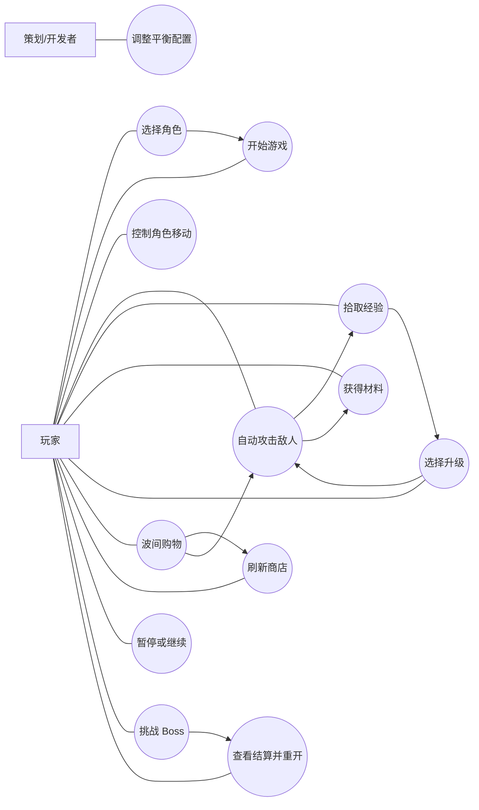

# 冬瓜兄弟：用例图与用例说明

## 1. 参与者定义

- 玩家：进行角色选择、战斗、升级、购物、结算
- 策划/开发者：调整配置并验证平衡

## 2. 用例图

## 3. 用例说明

### UC-01 选择角色

- 参与者：玩家
- 前置条件：游戏已启动，当前位于主菜单
- 触发条件：玩家点击角色卡片
- 基本流程：
  1. 系统切换当前选中角色
  2. 更新角色摘要、贴图与初始武器展示
- 结果：开始游戏将使用当前角色

### UC-02 开始游戏

- 参与者：玩家
- 前置条件：已进入主菜单并完成默认或手动选角
- 触发条件：玩家点击“开始游戏”
- 基本流程：
  1. 系统读取当前 `character_id`
  2. 加载主战斗场景
  3. 初始化玩家、波次、HUD
- 结果：玩家进入局内状态

### UC-03 控制角色移动

- 参与者：玩家
- 前置条件：角色已出生且未死亡
- 触发条件：玩家按下 `WASD`
- 基本流程：
  1. 系统读取输入
  2. 计算方向和速度
  3. 更新角色位置和朝向
- 结果：角色完成走位

### UC-04 自动攻击敌人

- 参与者：玩家、系统
- 前置条件：玩家拥有至少 1 把武器，场上存在敌人
- 触发条件：武器冷却结束
- 基本流程：
  1. 系统选择目标或攻击落点
  2. 生成投射物、范围效果或环绕武器
  3. 结算伤害与暴击
- 结果：敌人受伤或死亡

### UC-05 拾取经验

- 参与者：玩家
- 前置条件：敌人死亡并产生经验掉落
- 触发条件：玩家接近经验物
- 基本流程：
  1. 经验物进入拾取范围
  2. 系统将其吸附到玩家
  3. 玩家经验值增加
- 结果：经验累计并可能触发升级

### UC-06 获得材料

- 参与者：玩家
- 前置条件：敌人被击杀
- 触发条件：死亡结算发生
- 基本流程：
  1. 系统读取敌人 `drop_materials`
  2. 材料直接计入玩家钱包
  3. HUD 材料数更新
- 结果：玩家获得波间可消费资源

### UC-07 选择升级

- 参与者：玩家
- 前置条件：经验达到升级阈值
- 触发条件：玩家升级
- 基本流程：
  1. 系统暂停战斗
  2. 生成 3 个合法候选项
  3. 玩家选择 1 个选项
  4. 系统应用升级并恢复战斗
- 备选流程：
  - 若仍有待处理升级，则继续弹出下一轮升级
- 结果：玩家能力被强化

### UC-08 波间购物

- 参与者：玩家
- 前置条件：Wave 1~5 任一波次结束
- 触发条件：到达 `90/180/270/360/450s`
- 基本流程：
  1. 系统暂停战斗
  2. 若本帧触发升级，先完成升级流程
  3. 打开商店面板并显示 3 个商品
  4. 玩家购买商品或直接继续战斗
- 结果：进入下一波前完成局内消费

### UC-09 刷新商店

- 参与者：玩家
- 前置条件：当前正处于商店且尚未刷新
- 触发条件：玩家点击“刷新 20”
- 基本流程：
  1. 系统检查材料是否足够
  2. 扣除 `20` 材料
  3. 生成新的商品列表
- 结果：本店刷新次数耗尽

### UC-10 暂停或继续

- 参与者：玩家
- 前置条件：处于战斗中
- 触发条件：玩家按下 `Esc`
- 基本流程：
  1. 系统切换暂停状态
  2. 显示暂停菜单
  3. 玩家继续游戏或返回主菜单
- 结果：战斗暂停或恢复

### UC-11 挑战 Boss

- 参与者：玩家、系统
- 前置条件：生存到终局时间
- 触发条件：到达 Boss 时间点
- 基本流程：
  1. `540s` 触发预警
  2. `570s` 刷出 Boss
  3. 玩家战斗直至胜利或失败
- 结果：进入结算页

### UC-12 查看结算并重开

- 参与者：玩家
- 前置条件：本局胜利或失败
- 触发条件：进入结算页
- 基本流程：
  1. 系统显示生存时间、击杀数、主要武器
  2. 玩家选择“再来一局”或“返回菜单”
- 结果：开始新一局或回到主菜单

### UC-13 调整平衡配置

- 参与者：策划/开发者
- 前置条件：拥有项目数据配置访问权限
- 触发条件：需要调数值或节奏
- 基本流程：
  1. 修改角色、敌人、波次、升级或价格配置
  2. 重新运行游戏验证
- 结果：完成平衡迭代
