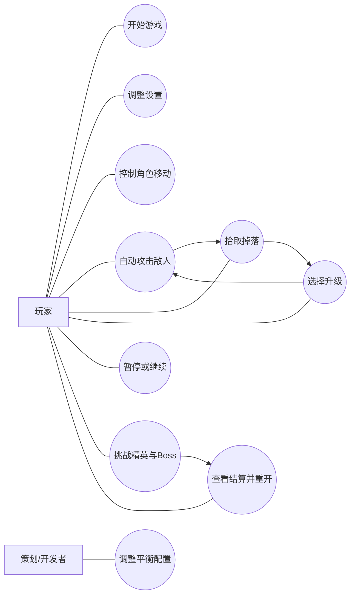

# 冬瓜兄弟：用例图与用例说明

## 1. 参与者定义

### 1.1 主要参与者
- 玩家：进行完整游玩、设置与重开

### 1.2 次要参与者
- 策划/开发者：调整配置，验证平衡

## 2. 用例图

## 3. 用例说明

### UC-01 开始游戏
- 参与者：玩家
- 前置条件：游戏已启动，当前位于主菜单
- 触发条件：玩家点击“开始游戏”
- 基本流程：
  1. 系统加载主战斗场景
  2. 初始化玩家、地图、波次、HUD
  3. 延迟 1~2 秒后刷出第一批敌人
- 结果：玩家进入局内状态

### UC-02 调整设置
- 参与者：玩家
- 前置条件：位于主菜单或暂停菜单
- 触发条件：玩家点击“设置”
- 基本流程：
  1. 系统打开设置面板
  2. 玩家调整音量或显示模式
  3. 玩家保存并返回
- 备选流程：
  - 玩家取消设置，系统恢复原值
- 结果：配置被应用并可持久化

### UC-03 控制角色移动
- 参与者：玩家
- 前置条件：已进入战斗且角色未死亡
- 触发条件：玩家按下 `WASD`
- 基本流程：
  1. 系统读取输入
  2. 计算目标方向和速度
  3. 更新角色位置和朝向
  4. 处理与障碍、掉落物、敌人的交互
- 结果：角色完成走位

### UC-04 自动攻击敌人
- 参与者：玩家、系统
- 前置条件：玩家拥有至少 1 把武器，场上存在敌人
- 触发条件：武器冷却结束
- 基本流程：
  1. 系统根据武器逻辑选择目标
  2. 生成投射物或范围效果
  3. 命中敌人并结算伤害
  4. 敌人死亡时触发掉落
- 结果：敌人受伤或死亡

### UC-05 拾取掉落
- 参与者：玩家
- 前置条件：敌人死亡并掉落资源
- 触发条件：玩家接近掉落物
- 基本流程：
  1. 掉落物进入拾取范围
  2. 系统将掉落物吸附到玩家
  3. 结算经验、回血或磁吸效果
- 结果：玩家获得资源收益

### UC-06 选择升级
- 参与者：玩家
- 前置条件：经验达到升级阈值
- 触发条件：玩家升级
- 基本流程：
  1. 系统暂停战斗
  2. 生成 3 个合法升级候选项
  3. 玩家选择 1 个选项
  4. 系统应用升级效果并恢复战斗
- 备选流程：
  - 若候选不足，系统从可用池补足
- 结果：玩家能力被强化

### UC-07 暂停或继续
- 参与者：玩家
- 前置条件：处于战斗中，未处于结算状态
- 触发条件：玩家按下 `Esc`
- 基本流程：
  1. 系统切换到暂停状态
  2. 显示暂停菜单
  3. 玩家选择继续、返回菜单或设置
- 结果：战斗暂停或恢复

### UC-08 挑战精英与 Boss
- 参与者：玩家、系统
- 前置条件：游戏时间推进到中后期
- 触发条件：波次配置达到精英或 Boss 条件
- 基本流程：
  1. 系统触发精英或 Boss 预警
  2. 刷新精英怪或 Boss
  3. 玩家躲避技能并持续输出
  4. 系统根据结果进入胜利或失败流程
- 结果：形成单局高潮

### UC-09 查看结算并重开
- 参与者：玩家
- 前置条件：本局胜利或失败
- 触发条件：进入结算页
- 基本流程：
  1. 系统显示生存时间、等级、击杀数、主要武器
  2. 玩家选择“再来一局”或“返回菜单”
- 结果：开始新一局或回到主菜单

### UC-10 调整平衡配置
- 参与者：策划/开发者
- 前置条件：拥有项目数据配置访问权限
- 触发条件：需要调整武器、敌人、波次或升级概率
- 基本流程：
  1. 修改配置表
  2. 重新运行游戏
  3. 验证数值与节奏变化
- 结果：完成平衡迭代
