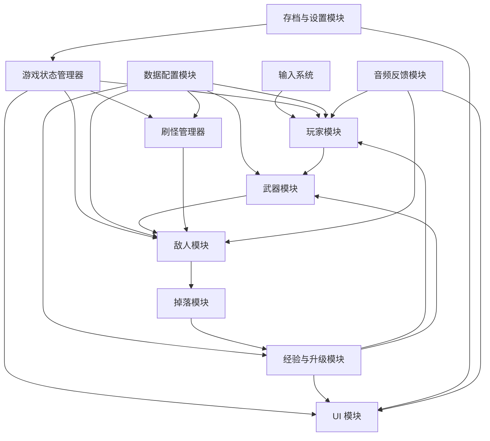
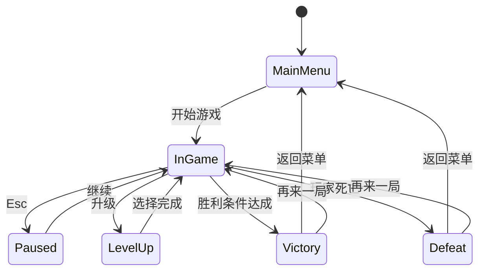

# 冬瓜兄弟：概要设计

## 1. 设计目标

概要设计的目标是把《冬瓜兄弟》拆解成一组可并行开发、可配置、可测试的模块，确保项目在两周开发周期中不被“脚本堆叠”拖垮。

设计原则：

1. 核心闭环优先。
2. 数据与逻辑分离。
3. 模块边界清晰。
4. UI 与战斗状态分离。
5. 性能问题在设计阶段预先规避。

## 2. 技术路线

### 2.1 推荐技术栈
- 引擎：Godot 4.3
- 语言：GDScript（MVP）或 C#（若团队更熟）
- 数据配置：JSON / Godot Resource
- 版本管理：Git
- 目标平台：Windows Desktop

### 2.2 选择理由
- 适合 2D 小型项目快速迭代
- 节点和场景便于拆模块
- 导出成本低，适合快速演示

## 3. 系统架构图



## 4. 主要模块划分

### 4.1 玩家模块
职责：
- 读取输入
- 控制移动
- 维护生命值和基础属性
- 接收全局强化
- 与拾取物发生交互

### 4.2 武器模块
职责：
- 管理已解锁武器
- 处理武器冷却
- 进行目标选择
- 生成投射物或范围伤害
- 响应升级带来的变化

### 4.3 敌人模块
职责：
- 管理敌人属性与状态
- 执行 AI 行为
- 接收伤害并死亡
- 触发掉落和反馈

### 4.4 刷怪管理器
职责：
- 按时间读取波次配置
- 控制敌人类型、刷新频率和场上上限
- 触发精英和 Boss 事件

### 4.5 掉落模块
职责：
- 管理经验、治疗包、磁吸核心等掉落
- 处理拾取和吸附逻辑

### 4.6 经验与升级模块
职责：
- 维护经验值与等级
- 判断升级阈值
- 生成升级选项
- 应用升级效果

### 4.7 UI 模块
职责：
- 展示 HUD、升级面板、暂停菜单、结算页
- 响应游戏状态变化

### 4.8 游戏状态管理器
职责：
- 统一管理菜单、战斗、暂停、升级、结算等状态
- 控制时间流逝与输入开关

### 4.9 数据配置模块
职责：
- 管理武器、敌人、波次、掉落、升级池配置
- 提供统一读取接口

### 4.10 存档与设置模块
职责：
- 保存音量、显示模式、局外解锁等轻量信息

## 5. 核心场景结构

建议场景结构如下：

```text
Main
  MenuRoot
  GameRoot
    World
    Player
    Spawner
    EnemyContainer
    ProjectileContainer
    DropContainer
    FxContainer
    UIRoot
```

Autoload 单例建议：

- `GameState`
- `ConfigRepo`
- `EventBus`
- `SaveService`
- `AudioService`

## 6. 数据设计原则

以下内容必须配置化：

- 武器基础属性与升级表
- 敌人基础属性
- 波次时间表
- 升级池权重
- 掉落权重

这样做的好处：

- 策划调平衡无需改逻辑
- 同一套逻辑可快速扩内容
- 降低回归风险

## 7. 状态设计

### 7.1 全局状态
- `Boot`
- `MainMenu`
- `InGame`
- `Paused`
- `LevelUp`
- `Victory`
- `Defeat`

### 7.2 战斗状态切换


## 8. 核心流程

### 8.1 局内主流程
1. 战斗开始
2. 玩家移动
3. 武器自动攻击
4. 敌人刷新并追击
5. 敌人死亡掉落资源
6. 玩家拾取并升级
7. 波次逐步升级
8. 精英/Boss 登场
9. 进入胜利或失败结算

### 8.2 数据流方向
- 配置数据只读进入模块
- 运行时状态在模块内部维护
- 重要事件通过 `EventBus` 广播给 UI、音频和特效

## 9. 性能设计

### 9.1 重点风险
- 大量敌人同时移动
- 高频投射物生成与销毁
- 掉落物数量堆积
- 每帧全量碰撞检测

### 9.2 预防策略
- 敌人、投射物、掉落使用对象池
- 限制场上最大敌人数与同类投射物数量
- 经验球允许吸附合并
- 将范围伤害和索敌做成定时扫描，不必每帧执行

## 10. 可扩展性设计

后续若扩展版本，可在不改主结构的情况下加入：

- 新武器
- 新敌人
- 新地图
- 局外成长
- 第二名角色皮肤或变体

前提是当前版本保持模块边界清楚，不把规则写死在某个单一脚本中。
