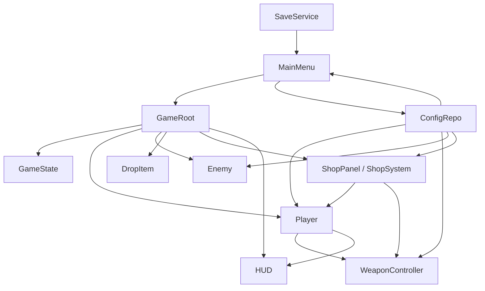
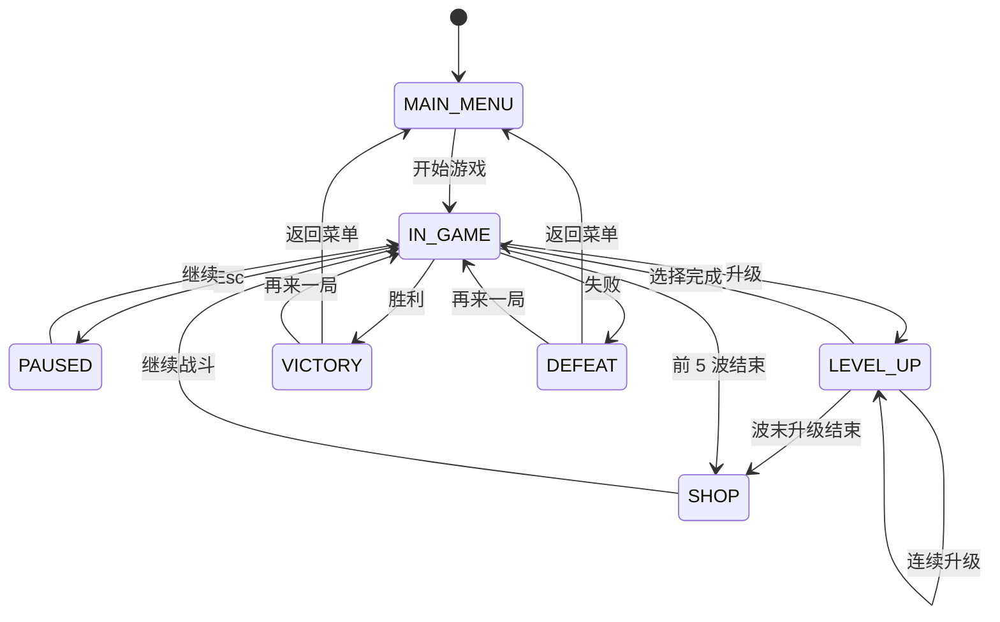
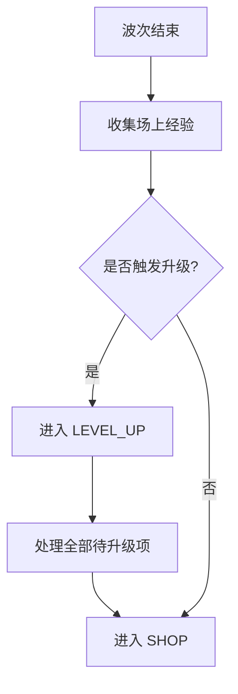

# 冬瓜兄弟：概要设计

## 1. 设计目标

本版概要设计用于支撑“2 角色 + 6 段波次 + 波间商店”的可玩闭环，确保数据可配、状态清晰、文档与实现一致。

设计原则：

1. 核心闭环优先
2. 数据与逻辑分离
3. 角色、战斗、商店分层
4. UI 与战斗状态解耦
5. 波次、升级、商店共用配置池

## 2. 技术路线

- 引擎：Godot 4.x
- 语言：GDScript
- 数据配置：JSON
- 目标平台：Windows Desktop

## 3. 系统架构图



## 4. 主要模块划分

### 4.1 MainMenu

职责：

- 显示主菜单按钮
- 展示角色卡片
- 输出 `start_game_requested(character_id)`

### 4.2 CharacterConfig

职责：

- 描述角色静态配置
- 提供名称、贴图、视觉参数、基础属性、初始武器

### 4.3 Player

职责：

- 读取角色配置并实例化战斗角色
- 管理生命、移速、暴击、拾取半径、材料与升级队列
- 响应伤害、经验、材料与升级

### 4.4 WeaponController

职责：

- 根据角色初始武器建立开局
- 管理持有武器、武器等级、冷却和攻击行为

### 4.5 ShopSystem / ShopPanel

职责：

- 在 `SHOP` 状态下展示商品
- 复用升级池生成合法商品
- 处理购买、售出、刷新、继续战斗

### 4.6 MaterialWallet

职责：

- 管理玩家局内材料余额
- 提供增加、扣费、余额读取能力

当前实现中该职责由 `Player.materials` 承担。

### 4.7 Wave / Spawn Flow

职责：

- 维护 6 段波次推进
- 在前 5 段结束时切入商店
- 控制 Boss 预警、Boss 刷新与最终结算

### 4.8 ConfigRepo

职责：

- 统一读取角色、敌人、波次、武器、升级配置
- 提供角色查询、波次索引、升级候选、商店候选接口

## 5. 场景结构

```text
Main
  MainMenu
  GameRoot
    ArenaBackground
    Player
    EnemyContainer
    ProjectileContainer
    DropContainer
    HUD
    LevelUpPanel
    ShopPanel
    ResultPanel
```

Autoload：

- `GameState`
- `ConfigRepo`
- `EventBus`
- `SaveService`
- `AudioService`

## 6. 状态设计

### 6.1 全局状态

- `MAIN_MENU`
- `IN_GAME`
- `PAUSED`
- `LEVEL_UP`
- `SHOP`
- `VICTORY`
- `DEFEAT`

### 6.2 状态切换图



## 7. 核心流程

### 7.1 主流程

1. 玩家在主菜单选择角色
2. `GameRoot.setup_run(character_id)`
3. `Player.configure(character_config)`
4. 战斗推进并按波次刷新敌人
5. 敌人死亡后：
   - 掉落经验物
   - 直接入账材料
6. 玩家升级时暂停并选择强化
7. Wave 1~5 结束进入商店
8. 商店消费完成后进入下一波
9. 终局进入 Boss 预警、Boss 战和结算

### 7.2 升级与商店优先级



## 8. 数据设计原则

以下内容必须配置化：

- `CharacterConfig`
- 武器基础属性
- 敌人基础属性与材料掉落
- 6 段波次时间表
- 升级候选池与 `shop_price`

## 9. 扩展性说明

当前结构可继续支撑：

- 第 3 个角色
- 更多敌人与武器
- 更复杂商店机制
- 局外成长

前提是继续保持“配置驱动 + 状态清晰”的架构。
