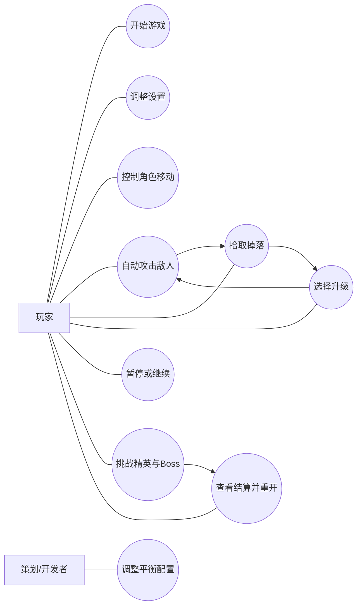

# 冬瓜兄弟：产品要求与迭代说明汇总

## 1. 产品需求

### 1.1 产品名称
《冬瓜兄弟》

### 1.2 产品类型
单人俯视角肉鸽生存类游戏

### 1.3 产品目标
- 两周内完成可演示 MVP
- 单局 10 分钟左右
- 具备完整战斗闭环、升级闭环和胜负闭环

### 1.4 核心体验
- 上手快
- 爽感强
- 构筑清晰
- 节奏递进

### 1.5 功能要求总表
| 编号 | 功能 | 说明 | 优先级 |
|---|---|---|---|
| FR-01 | 主菜单 | 开始游戏、设置、退出 | P0 |
| FR-02 | 玩家控制 | WASD 移动、受伤、死亡 | P0 |
| FR-03 | 自动攻击 | 武器自动索敌并攻击 | P0 |
| FR-04 | 敌人与伤害 | 敌人追击、接触或技能造成伤害 | P0 |
| FR-05 | 经验与升级 | 掉落鲜度能量、升级三选一 | P0 |
| FR-06 | 波次系统 | 按时间切换敌人池和刷新频率 | P0 |
| FR-07 | HUD | 血条、经验条、等级、时间 | P0 |
| FR-08 | 暂停与结算 | 暂停、胜负结算、重开 | P0 |
| FR-09 | 武器与被动内容 | 4~6 武器、6~10 被动 | P1 |
| FR-10 | 精英与 Boss | 精英怪、Boss、预警机制 | P1 |
| FR-11 | 掉落扩展 | 治疗包、磁吸核心 | P1 |
| FR-12 | 设置与存档 | 音量、窗口模式、基础持久化 | P2 |

### 1.6 内容边界
不做联机、不做多地图、不做复杂剧情、不做多角色大差异。

---

## 2. 故事列表

### 2.1 Epic 划分
- E1：基础进入与主循环
- E2：战斗与成长
- E3：内容扩展
- E4：完成度与反馈
- E5：配置化与可维护性

### 2.2 用户故事
| 编号 | Epic | 用户故事 | 优先级 |
|---|---|---|---|
| US-01 | E1 | 作为玩家，我想在主菜单点击“开始游戏”，以便快速进入战斗。 | P0 |
| US-02 | E1 | 作为玩家，我想用 `WASD` 平滑移动角色，以便通过走位规避怪物。 | P0 |
| US-03 | E1 | 作为玩家，我想看到角色生命值变化，以便判断自己是否危险。 | P0 |
| US-04 | E1 | 作为玩家，我想让敌人持续追击我，以便形成最基本的生存压力。 | P0 |
| US-05 | E2 | 作为玩家，我想角色自动攻击最近敌人，以便把精力放在走位和升级决策上。 | P0 |
| US-06 | E2 | 作为玩家，我想在击杀敌人后获得鲜度能量，以便不断升级。 | P0 |
| US-07 | E2 | 作为玩家，我想在升级时从三个选项里做选择，以便形成自己的流派。 | P0 |
| US-08 | E2 | 作为玩家，我想在前几次升级里更容易获得新武器，以便更快进入构筑状态。 | P1 |
| US-09 | E2 | 作为玩家，我想获得不同功能的被动强化，以便提升全局战斗效率。 | P1 |
| US-10 | E3 | 作为玩家，我想遇到速度、血量、远程方式都不同的敌人，以便感受阶段变化。 | P1 |
| US-11 | E3 | 作为玩家，我想在不同时间段面对不同怪潮，以便每局都有明确节奏。 | P0 |
| US-12 | E3 | 作为玩家，我想在中局遇到精英怪，以便感受到阶段高潮。 | P1 |
| US-13 | E3 | 作为玩家，我想在终局遭遇 Boss，以便形成完整的一局高潮。 | P1 |
| US-14 | E3 | 作为玩家，我想通过治疗包和磁吸核心改变当前路线选择，以便获得更强奖励感。 | P1 |
| US-15 | E4 | 作为玩家，我想看到血条、经验条、等级和倒计时，以便清楚掌握局势。 | P0 |
| US-16 | E4 | 作为玩家，我想在按下 `Esc` 后暂停游戏，以便中断和继续本局。 | P0 |
| US-17 | E4 | 作为玩家，我想在失败或胜利后看到结算页，以便复盘本局表现并快速重开。 | P0 |
| US-18 | E4 | 作为玩家，我想听到命中、升级、死亡和 Boss 预警反馈，以便玩起来更爽。 | P1 |
| US-19 | E5 | 作为策划，我想通过配置表调整武器、敌人、波次和升级项，以便快速平衡。 | P0 |
| US-20 | E5 | 作为开发者，我想把敌人、子弹和掉落物放入对象池，以便避免中后期卡顿。 | P1 |
| US-21 | E5 | 作为开发者，我想把游戏状态、UI 和战斗逻辑解耦，以便更容易维护和扩展。 | P0 |
| US-22 | E5 | 作为玩家，我想保存基础设置项，以便下次启动时无需重新调整。 | P2 |

---

## 3. 用例图

---

## 4. 第一次迭代故事

### 4.1 迭代名称
第一次迭代：最小战斗闭环

### 4.2 迭代目标
第一次迭代结束时，项目必须达到“能玩”的最低标准：

- 能进入战斗场景
- 玩家可移动并受伤死亡
- 敌人可追击玩家
- 玩家有一把基础自动武器
- 敌人死亡可掉落经验
- 玩家可升级并进行三选一

### 4.3 纳入故事
- US-01 主菜单进入游戏
- US-02 玩家移动
- US-03 玩家生命与死亡
- US-04 敌人追击与接触伤害
- US-05 自动攻击
- US-06 经验掉落与拾取
- US-07 升级三选一
- US-15 最小 HUD

### 4.4 不纳入内容
- 多把武器切换
- 被动系统完整版本
- 精英怪与 Boss
- 暂停、设置、结算美化
- 多种敌人类型

### 4.5 迭代交付物
- 可进入的主菜单
- 1 张测试地图
- 1 名可控角色
- 1 类基础敌人
- 1 把默认武器
- 经验拾取与升级面板
- 最小 HUD（血条、经验条、等级）

### 4.6 迭代验收标准
1. 能从菜单进入战斗。
2. 玩家可以移动、受伤、死亡。
3. 敌人可以追击并造成威胁。
4. 玩家可以自动杀怪。
5. 敌人会掉落经验，玩家能升级。
6. 升级后战斗体验能明显变化。

---

## 5. 第一次迭代故事的需求说明

### I1-US-01 进入游戏
- 前置条件：游戏已启动，当前位于主菜单
- 触发条件：玩家点击“开始游戏”
- 基本流程：
  1. 系统加载主战斗场景
  2. 初始化玩家、地图、波次、HUD
  3. 延迟 1~2 秒后刷出第一批敌人
- 结果：玩家进入局内状态

### I1-US-02 玩家移动
- 前置条件：已进入战斗且角色未死亡
- 触发条件：玩家按下 `WASD`
- 基本流程：
  1. 系统读取输入
  2. 计算目标方向和速度
  3. 更新角色位置和朝向
  4. 处理与障碍、掉落物、敌人的交互
- 结果：角色完成走位

### I1-US-03 玩家生命与死亡
- 前置条件：角色处于战斗状态
- 触发条件：被敌人接触或技能命中
- 基本流程：
  1. 扣减生命值
  2. 播放受击反馈
  3. 生命归零后进入失败状态
- 结果：角色死亡并进入结算

### I1-US-04 敌人追击与接触伤害
- 前置条件：敌人已生成
- 触发条件：玩家进入敌人感知范围
- 基本流程：
  1. 敌人持续朝玩家移动
  2. 接触玩家时造成固定伤害
  3. 玩家受击后进入短暂无敌
- 结果：形成持续威胁

### I1-US-05 自动攻击
- 前置条件：玩家拥有默认武器
- 触发条件：武器冷却结束
- 基本流程：
  1. 武器自动索敌
  2. 发射投射物或触发攻击效果
  3. 命中敌人并结算伤害
- 结果：敌人受伤或死亡

### I1-US-06 经验掉落与拾取
- 前置条件：敌人死亡
- 触发条件：经验球掉落并进入拾取范围
- 基本流程：
  1. 敌人死亡掉落鲜度能量
  2. 玩家靠近后自动拾取
  3. 经验条更新
- 结果：经验累计

### I1-US-07 升级三选一
- 前置条件：经验达到升级阈值
- 触发条件：玩家升级
- 基本流程：
  1. 系统暂停战斗
  2. 生成 3 个合法升级候选项
  3. 玩家选择 1 个选项
  4. 系统应用升级效果并恢复战斗
- 结果：玩家能力被强化

### I1-US-15 最小 HUD
- 前置条件：已进入战斗
- 触发条件：战斗状态持续更新
- 基本流程：
  1. 显示血条
  2. 显示经验条
  3. 显示当前等级
- 结果：玩家清楚掌握状态

---

## 6. 对象和行为列表

### 6.1 对象列表
| 对象名称 | 类型 | 关键属性 | 核心职责 |
|---|---|---|---|
| PlayerActor | 角色对象 | hp、speed、pickup_radius、buffs | 处理输入、移动、受伤、死亡、拾取 |
| PlayerStats | 数据对象 | base_stats、runtime_modifiers | 统一计算玩家最终属性 |
| WeaponController | 控制器 | unlocked_weapons、weapon_slots | 管理玩家持有武器和释放节奏 |
| WeaponRuntime | 运行时对象 | level、cooldown_timer | 表示一把武器的当前状态 |
| WeaponConfig | 配置对象 | damage、cooldown、type | 定义武器静态规则 |
| Projectile | 战斗对象 | damage、speed、pierce | 执行飞行、命中和销毁 |
| EnemyActor | 敌人对象 | hp、ai_type、damage | 执行追击、攻击、死亡 |
| EnemyConfig | 配置对象 | hp、speed、drop_exp | 定义敌人静态规则 |
| EliteEnemy | 敌人对象 | extra_skill、reward_bonus | 表示强化敌人 |
| BossActor | 敌人对象 | phase、skill_set | 表示终局 Boss 及阶段机制 |
| SpawnManager | 系统对象 | timer、wave_index、max_alive | 按波次刷怪 |
| WaveConfig | 配置对象 | time_range、enemy_pool | 定义每个阶段刷怪规则 |
| DropItem | 资源对象 | drop_type、value | 被玩家拾取并结算收益 |
| LevelSystem | 系统对象 | current_exp、level | 管理经验、升级和选项生成 |
| UpgradeOption | 数据对象 | id、type、weight | 表示一次升级候选 |
| HUDController | UI 对象 | hp_bar、exp_bar、timer | 更新常驻战斗信息 |
| UpgradePanel | UI 对象 | option_cards | 展示三选一 |
| PauseMenu | UI 对象 | buttons | 处理暂停和设置入口 |
| ResultPanel | UI 对象 | stats、actions | 展示胜负结算 |
| GameStateManager | 系统对象 | current_state | 切换菜单、战斗、暂停、结算 |
| ConfigRepo | 服务对象 | weapon_db、enemy_db | 提供统一配置读取 |
| SaveService | 服务对象 | settings、meta_progress | 保存设置与轻量进度 |
| AudioService | 服务对象 | bgm_bus、sfx_bus | 播放音频反馈 |
| EffectPool | 服务对象 | hit_fx、death_fx | 管理特效对象池 |
| EventBus | 服务对象 | signals | 广播跨模块事件 |

### 6.2 行为列表
| 行为编号 | 对象 | 行为名称 | 触发条件 | 结果 |
|---|---|---|---|---|
| BH-01 | PlayerActor | 移动 | 玩家按下方向键 | 更新位置并播放移动动画 |
| BH-02 | PlayerActor | 受伤 | 被敌人接触或技能命中 | 扣血、闪白、触发无敌时间 |
| BH-03 | PlayerActor | 死亡 | 当前生命值小于等于 0 | 广播失败事件并禁用输入 |
| BH-04 | WeaponController | 自动攻击 | 武器冷却结束 | 选择目标并创建攻击 |
| BH-05 | WeaponRuntime | 升级 | 选择相关升级项 | 提高等级并刷新数值 |
| BH-06 | Projectile | 飞行 | 投射物被创建 | 按方向移动直到命中或超时 |
| BH-07 | Projectile | 命中 | 进入敌人碰撞区域 | 结算伤害，更新穿透次数 |
| BH-08 | EnemyActor | 追击 | 玩家进入感知范围 | 朝玩家移动 |
| BH-09 | EnemyActor | 攻击 | 与玩家接触或到达技能条件 | 对玩家造成伤害 |
| BH-10 | EnemyActor | 死亡 | 生命值归零 | 播放死亡反馈并掉落资源 |
| BH-11 | SpawnManager | 刷怪 | 到达波次刷新时刻 | 在视野外生成敌人 |
| BH-12 | SpawnManager | 切波次 | 局内时间进入新区间 | 替换敌人池与刷新频率 |
| BH-13 | SpawnManager | 召唤 Boss | 到达终局时间点 | 广播预警并刷出 Boss |
| BH-14 | DropItem | 吸附 | 玩家进入拾取范围 | 向玩家移动 |
| BH-15 | DropItem | 被拾取 | 接触玩家 | 结算经验/回血/磁吸效果 |
| BH-16 | LevelSystem | 累积经验 | 玩家拾取鲜度能量 | 增加经验并判断是否升级 |
| BH-17 | LevelSystem | 生成选项 | 玩家升级 | 从合法池里抽取 3 项 |
| BH-18 | LevelSystem | 应用升级 | 玩家选择升级项 | 更新武器或全局属性 |
| BH-19 | HUDController | 刷新状态 | 玩家生命、经验、时间变化 | 更新血条、经验条和倒计时 |
| BH-20 | PauseMenu | 暂停/恢复 | 玩家按 `Esc` | 切换游戏时间流逝状态 |
| BH-21 | ResultPanel | 展示结算 | 胜利或失败事件触发 | 显示统计并提供重开入口 |
| BH-22 | AudioService | 播放音效 | 命中、升级、死亡等事件触发 | 播放对应 SFX |
| BH-23 | EffectPool | 播放特效 | 命中、爆炸、升级事件触发 | 复用特效对象进行表现 |
